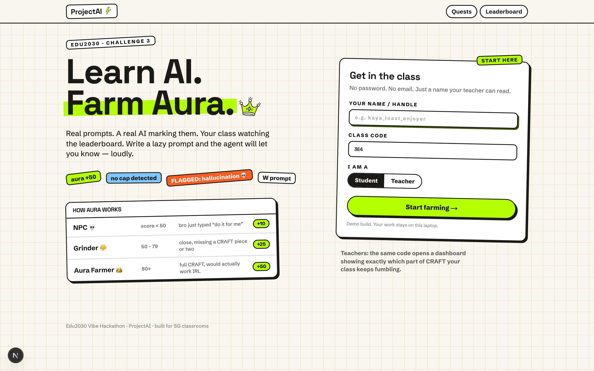
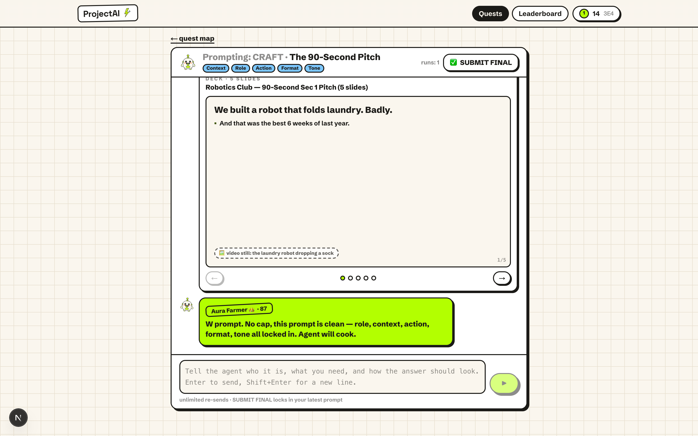
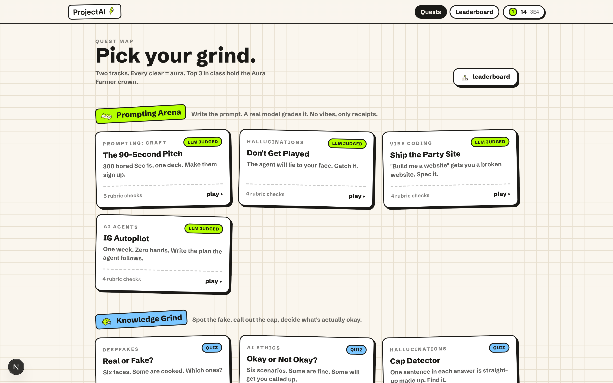
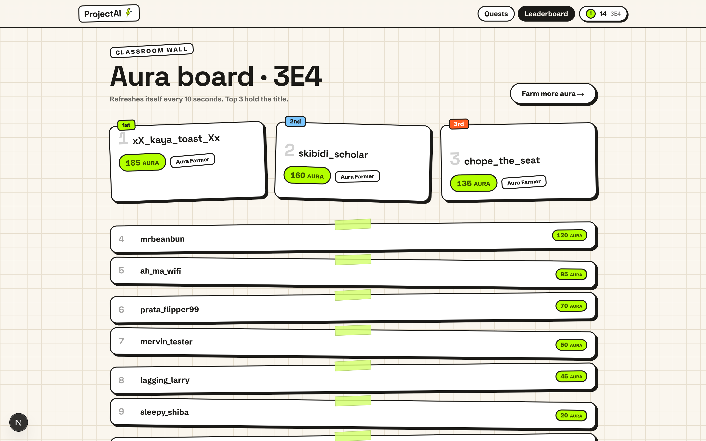
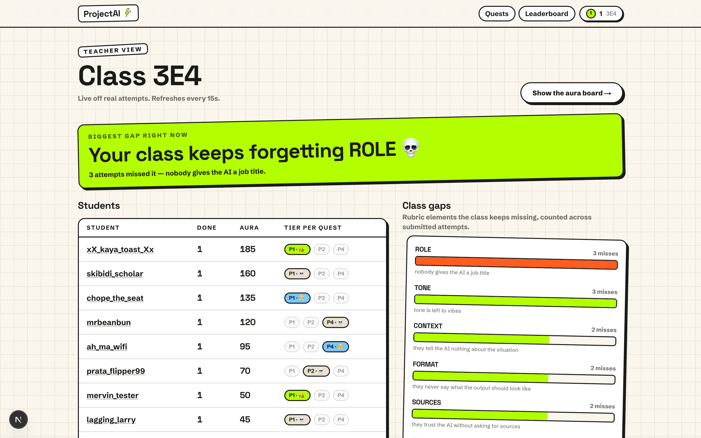

# ProjectAI ⚡ — Learn AI. Farm Aura.

A gamified AI-literacy platform for Singapore classrooms, built in one morning at the **Edu2030 Vibe Hackathon** (13 Sep 2026, MOE HQ) for **Challenge 3: Education that Prepares Students for an AI-Driven Future**.

Students don't read about prompting — they prompt. A real LLM judges every prompt against a rubric, *actually executes it*, and shows them exactly what their prompt earned: a thin, generic mess, or something they could genuinely use. Better prompts, better artifacts, more aura, higher on the class leaderboard.



## How it works

The core loop is a chat with an agent:

1. Each quest drops the student into a chat with a scenario and an objective ("your CCA has 90 seconds at assembly — make the pitch deck").
2. The student writes a prompt. Two LLM calls fire concurrently:
   - **The judge** grades the prompt against the quest's rubric (the CRAFT framework — Context, Role, Action, Format, Tone) and returns a score, tier, and one line of coaching.
   - **The executor** actually runs the prompt, under one hard rule: *produce output strictly at the quality the prompt earns.* Vague prompt in, filler slides out. It never rescues a lazy prompt with invented specifics.
3. The output renders as the real artifact — a flippable slide deck, a website in a browser frame, an agent plan doc, a research brief — not a wall of text.
4. Weak run → the agent avatar pops in with a roast and the missing rubric elements. Unlimited retries.
5. **Submit** locks it in: tier reveal, aura, leaderboard.



### Tiers

| Tier | Score | Aura |
|---|---|---|
| NPC 💀 | < 50 | +10 |
| Grinder 😤 | 50–79 | +25 |
| Aura Farmer 👑 | 80+ | +50 |

Top 3 in the class hold the **Aura Farmer** title. First-try success earns a bonus.

## The quests



**Prompting Arena** (LLM-judged, real execution):

| Subject | Quest | You produce |
|---|---|---|
| Prompting: CRAFT | The 90-Second Pitch | A 5-slide CCA assembly pitch deck |
| Vibe Coding | Ship the Party Site | A class-party sign-up website |
| AI Agents | IG Autopilot | A one-week agent plan for the class Instagram |
| Hallucinations | Don't Get Played | A research brief — and a trap |

**Don't Get Played** is the one we're proudest of: unless the student's prompt demands verification and sources, the agent plants two false facts and a fabricated citation in an otherwise-plausible research brief. Submit without catching them and the screen takes over: **🚨 FLAGGED — you just shipped a hallucination**, with the fakes revealed. That lesson sticks.

**Knowledge Grind** (quizzes): Deepfakes (real or fake?), AI Ethics (okay or not okay?), Hallucinations (spot the cap).

## The classroom layer



Students join with a name and a class code — no accounts, no email. The class leaderboard auto-refreshes; teachers get a dashboard showing per-student progress *and aggregated rubric gaps*, so they can see at a glance that, say, the whole class keeps forgetting **Format**.



## Stack

- **Next.js 15** (App Router, TypeScript) — one process, API routes as the backend
- **SQLite** via better-sqlite3 — zero-setup persistence in `data/app.db`
- **OpenRouter → Claude Haiku 4.5** — judge + executor, strict-JSON outputs
- **Tailwind v4** + hand-rolled design tokens — the "arcade classroom" look
- Offline fallback everywhere: if the network dies mid-demo, a rule-based scorer and hand-written fallback artifacts keep the loop running (artifacts get an "offline mode" stamp)

## Run it

```bash
npm install
echo "OPENROUTER_API_KEY=sk-or-..." > .env.local
npm run dev
```

Join with any name. Class code `3E4` comes pre-seeded with a class so the leaderboard and teacher dashboard aren't empty.

## Honest limitations

Built in ~2 hours for a live demo, so: **there is no real auth** — identity is a client-readable cookie, and anyone can act as anyone. Grading calls cost real (tiny) money per run. The deepfake quiz ships without images until you add six to `public/deepfakes/`. None of this is production software; all of it is a working argument that AI literacy should be taught by doing.

## Credits

Built by the ProjectAI team at the Edu2030 Vibe Hackathon (Reactor School × MAJU, supported by MOE & MCCY). Mascot art generated, everything else hand-assembled under extreme time pressure and mild caffeine.
